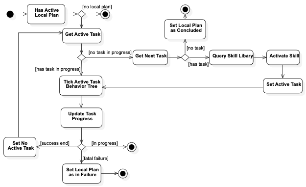

A skill implementation has a defined life, which is controlled by the sequencing process through the ActiveSkillCtrl, which is responsible for activating and ticking the skill. The sequencing process is as as follows.

To proper work with MissionControl runtime, an skill implementation must extend the "SkillImplementation" class.

[source,python]
----
include::../../mission_control/mission_control/execution/component_model_interfaces.py[]
----